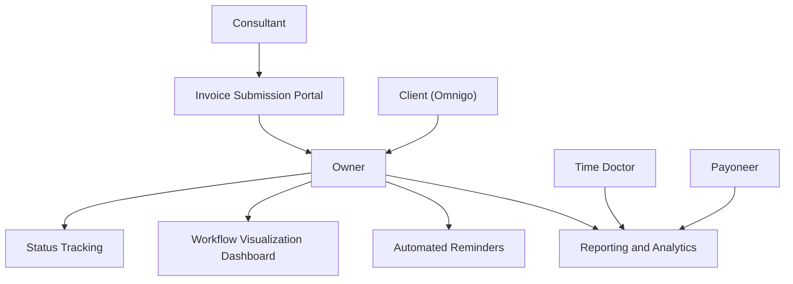

```mermaid
flowchart TD
  owner["Owner"]
  consultant["Consultant"]
  client["Client (Omnigo)"]
  invoice_portal["Invoice Submission Portal"]
  reminders["Automated Reminders"]
  dashboard["Workflow Visualization Dashboard"]
  status_tracking["Status Tracking"]
  reporting["Reporting and Analytics"]
  time_doctor["Time Doctor"]
  payoneer["Payoneer"]

  consultant --> invoice_portal
  invoice_portal --> owner
  owner --> reminders
  owner --> dashboard
  owner --> reporting
  owner --> status_tracking
  time_doctor --> reporting
  payoneer --> reporting
  client --> owner
```