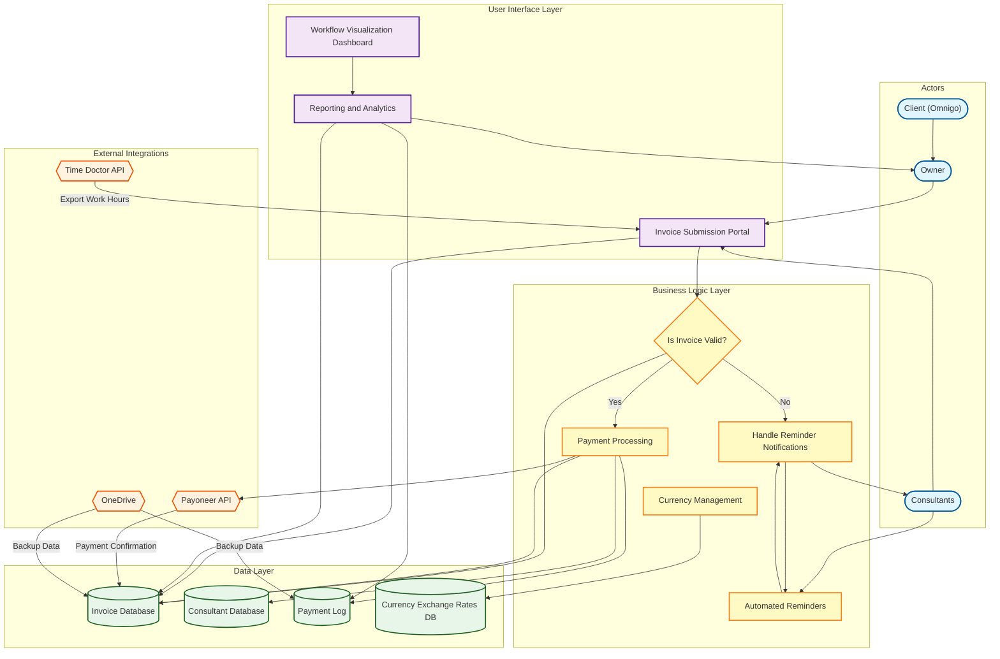

```mermaid
flowchart TD
    %% Define subgraphs for organization
    subgraph actors["Actors"]
        direction LR
        owner(["Owner"])
        consultants(["Consultants"])
        client_omnigo(["Client (Omnigo)"])
    end

    subgraph ui_layer["User Interface Layer"]
        direction LR
        invoice_submission_portal["Invoice Submission Portal"]
        workflow_visualization_dashboard["Workflow Visualization Dashboard"]
        reporting_and_analytics["Reporting and Analytics"]
    end

    subgraph business_logic["Business Logic Layer"]
        direction TB
        automated_reminders["Automated Reminders"]
        currency_management["Currency Management"]
        invoice_validation{"Is Invoice Valid?"}
        payment_processing["Payment Processing"]
        reminder_handler["Handle Reminder Notifications"]
    end

    subgraph integrations["External Integrations"]
        direction LR
        payoneer{{"Payoneer API"}}
        time_doctor{{"Time Doctor API"}}
        onedrive{{"OneDrive"}}
    end

    subgraph data_layer["Data Layer"]
        direction LR
        invoice_db[("Invoice Database")]
        consultant_db[("Consultant Database")]
        payment_log[("Payment Log")]
        currency_db[("Currency Exchange Rates DB")]
    end

    %% Define workflows and connections
    %% Actor interactions
    owner --> invoice_submission_portal
    consultants --> invoice_submission_portal
    consultants --> automated_reminders
    client_omnigo --> owner

    %% UI layer to business logic
    invoice_submission_portal --> invoice_validation
    workflow_visualization_dashboard --> reporting_and_analytics
    reporting_and_analytics --> owner

    %% Business logic workflows
    invoice_validation -->|Yes| payment_processing
    invoice_validation -->|No| reminder_handler
    automated_reminders --> reminder_handler
    payment_processing --> payoneer
    payment_processing --> payment_log

    %% Data storage interactions
    invoice_submission_portal --> invoice_db
    invoice_validation --> invoice_db
    payment_processing --> invoice_db
    payment_processing --> consultant_db
    currency_management --> currency_db
    reporting_and_analytics --> invoice_db
    reporting_and_analytics --> payment_log

    %% External integrations
    time_doctor -->|Export Work Hours| invoice_submission_portal
    payoneer -->|Payment Confirmation| invoice_db
    onedrive -->|Backup Data| invoice_db
    onedrive -->|Backup Data| payment_log

    %% Decision points and error handling
    reminder_handler --> automated_reminders
    reminder_handler --> consultants

    %% Styling for clarity
    classDef actorStyle fill:#e1f5ff,stroke:#01579b,stroke-width:2px
    classDef uiStyle fill:#f3e5f5,stroke:#4a148c,stroke-width:2px
    classDef logicStyle fill:#fff9c4,stroke:#f57f17,stroke-width:2px
    classDef integrationStyle fill:#fff3e0,stroke:#e65100,stroke-width:2px
    classDef dataStyle fill:#e8f5e9,stroke:#1b5e20,stroke-width:2px

    class owner,consultants,client_omnigo actorStyle
    class invoice_submission_portal,workflow_visualization_dashboard,reporting_and_analytics uiStyle
    class automated_reminders,currency_management,invoice_validation,payment_processing,reminder_handler logicStyle
    class payoneer,time_doctor,onedrive integrationStyle
    class invoice_db,consultant_db,payment_log,currency_db dataStyle
```